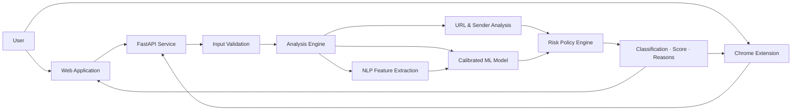

<div align="center">


# NEXUS

### AI-Powered Phishing Detection & Risk Analysis

**Smarter Analysis for a Safer Tomorrow**

Nexus is an intelligent cybersecurity platform that detects phishing threats in emails, URLs, and suspicious text using machine learning, natural language processing, and explainable security analysis.

<br>

[](https://nexus-phishing-detector.onrender.com/)

[](https://github.com/sic-graduation-project/phishing-email-detector)
[](https://nexus-phishing-api.onrender.com/docs)

<br>


</div>

---

## About Nexus

Nexus was developed by a six-member multidisciplinary team as a graduation project for the **Samsung Innovation Campus — Artificial Intelligence Program**.

Our objective is to make phishing analysis faster, clearer, and more accessible by combining artificial intelligence with explainable cybersecurity signals.

The platform provides:

- A responsive web application
- A production-ready REST API
- A Chrome browser extension
- A calibrated machine-learning pipeline
- Explainable risk scores and detection reasons
- URL, sender, text, and email analysis

---

## What Nexus Can Analyze

| ✉️ Email Analysis | 🔗 URL Analysis | 📝 Text Analysis |
|:---:|:---:|:---:|
| Examines the sender, subject, body, language patterns, and embedded URLs. | Detects suspicious domains, IP-based links, shorteners, unsafe protocols, and phishing terms. | Identifies urgency, credential requests, social-engineering language, and embedded links. |
| **Classification + Risk Score + Reasons** | **URL Risk Assessment** | **Explainable Text Assessment** |

---

## Intelligent Detection Pipeline



Nexus combines machine-learning predictions with deterministic security policies. This multi-layer approach provides results that are both intelligent and understandable.

---

## Key Capabilities

- 🛡️ Multi-layer phishing detection
- 🧠 Calibrated machine-learning classification
- 🔍 Explainable risk indicators
- ⚡ Real-time REST API
- 🖥️ Responsive security dashboard
- 🧩 Chrome Manifest V3 extension
- 📊 Analysis history and notifications
- 🌙 Light and dark interface modes
- 🚦 API validation and rate limiting
- 🔄 Automated testing with GitHub Actions
- ☁️ Production deployment on Render

---

## Live Platform

| Service | Access |
|---|---|
| 🌐 **Nexus Web Application** | [Open Live Application](https://nexus-phishing-detector.onrender.com/) |
| 📘 **Interactive API Documentation** | [Open Swagger UI](https://nexus-phishing-api.onrender.com/docs) |
| ❤️ **API Health Check** | [Check API Status](https://nexus-phishing-api.onrender.com/api/v1/health) |
| 💻 **Source Code** | [View Main Repository](https://github.com/sic-graduation-project/phishing-email-detector) |

> The first request may take a short time while the Render service starts after inactivity.

---

## Technology

| Area | Technologies |
|---|---|
| **Frontend** | React, TypeScript, Vite, Tailwind CSS, Framer Motion, Recharts |
| **Backend** | Python, FastAPI, Uvicorn, Pydantic |
| **AI & Machine Learning** | scikit-learn, TF-IDF, calibrated Linear SVC, pandas, NumPy, SciPy |
| **Natural Language Processing** | NLTK, text normalization, language-pattern features |
| **URL Intelligence** | Domain analysis, IP detection, shortener detection, security heuristics |
| **Browser Integration** | Chrome Extension Manifest V3 |
| **Testing & Quality** | Pytest, oxlint, TypeScript, GitHub Actions |
| **Deployment** | Render Web Service and Static Site |

---

## Featured Project

### [Nexus Phishing Email Detector](https://github.com/sic-graduation-project/phishing-email-detector)

An end-to-end artificial intelligence platform for detecting phishing attempts across emails, URLs, and text.

The repository contains the complete system:

```text
Nexus
├── AI and machine-learning pipeline
├── NLP feature extraction
├── URL and sender analysis
├── FastAPI backend
├── React dashboard
├── Chrome extension
├── Automated tests
└── Production deployment
```

[](https://github.com/sic-graduation-project/phishing-email-detector)

---

## Team Nexus

| Member | Primary Responsibility |
|---|---|
| **Eng. Heba** | Dataset and data preprocessing |
| **Eng. Buthaina** | NLP and text feature engineering |
| **Eng. Sulaiman** | Machine-learning development and evaluation |
| **Eng. Rayan** | URL and email-header analysis |
| **Eng. Anas** | Backend, API, and system integration |
| **Eng. Amal** | Frontend and dashboard experience |

Our work is built on collaboration, clear ownership, responsible AI, and security-first engineering.

---

## Our Vision

> To make intelligent phishing detection understandable, accessible, and practical for every user.

Nexus is designed not only to classify suspicious content, but also to explain why it may be dangerous. We believe cybersecurity tools should support informed human decisions through clear and transparent analysis.

---

## Academic Notice

Nexus is an independent student graduation project developed within the **Samsung Innovation Campus** program.

It is not an official Samsung product or commercial security service. Samsung and Samsung Innovation Campus names and trademarks belong to their respective owners.

---

## Connect With Team Nexus

<div align="center">

[](https://github.com/devanasly)
[](https://github.com/amalelhaddad)

[](https://github.com/buthinaaaa)
[](https://github.com/hebawl)

[](https://github.com/rayan-adel)
[](https://github.com/Sully99)

</div>

---

<div align="center">

### NEXUS

**Smarter Analysis for a Safer Tomorrow**

[Try Nexus](https://nexus-phishing-detector.onrender.com/) ·
[Explore the Project](https://github.com/sic-graduation-project/phishing-email-detector) ·
[API Documentation](https://nexus-phishing-api.onrender.com/docs)

<br>

© 2026 Nexus Team. All rights reserved.

</div>
